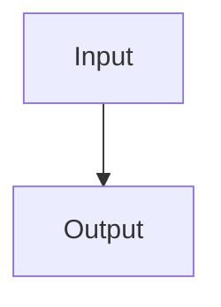

# @koumoul/doc

Preview and export professional A4 documents from Markdown.

`@koumoul/doc` turns a single Markdown file into a polished, print-ready document with a title page, table of contents, syntax-highlighted code blocks, Mermaid diagrams, and PDF export.

## Requirements

Node.js >= 23.6.0

## Installation

```bash
npm install @koumoul/doc
```

## Usage

The CLI exposes two commands:

```bash
# Live preview with hot reload
koumoul-doc dev document.md

# Export to PDF
koumoul-doc export document.md
```

### Options

| Option | Default | Description |
|--------|---------|-------------|
| `--port` | `5173` | Dev server port (`dev` only) |
| `--output` | auto | Output PDF path (`export` only) |

## Markdown features

### Frontmatter

YAML frontmatter controls the title page and document options:

```yaml
---
title: My Document
version: "1.0"
date: "2025-01-15"
description: A brief summary shown on the title page.
warning: Displayed as a red warning box on the title page.
toc: true
tocLevels: 2
theme: koumoul
---
```

All fields are optional. Omitting `version` displays a draft warning. `tocLevels` controls how many heading levels are shown in the table of contents (default `2` — `h2` as level 1 and `h3` as level 2, since `h1` is reserved for the generated title page).

### Page breaks

Use a horizontal rule to insert a page break:

```markdown
---
```

### Custom containers

Four styled container types are available:

```markdown
:::info
Informational content.
:::

:::tip
Helpful advice.
:::

:::warning
Proceed with caution.
:::

:::danger
Critical warning.
:::
```

### Code blocks

Syntax highlighting (via Shiki) supports JavaScript, TypeScript, JSON, HTML, CSS, Bash, YAML, Python, SQL, and Markdown.

### Mermaid diagrams

Fenced code blocks with the `mermaid` language tag are rendered as diagrams:

````markdown

````

## Themes

Two built-in themes are available:

- **koumoul** (default) -- branded theme with custom colors and logo
- **minimal** -- neutral styling

Set the theme via the `theme` frontmatter field (defaults to `koumoul`). Themes control colors, fonts, and optional logo display on the title page via CSS variables.

## Development

```bash
npm run dev          # Preview example.md
npm run lint         # Lint
npm run typecheck    # Type check
npm run test         # Unit tests
npm run test:e2e     # E2E tests (Playwright)
```
