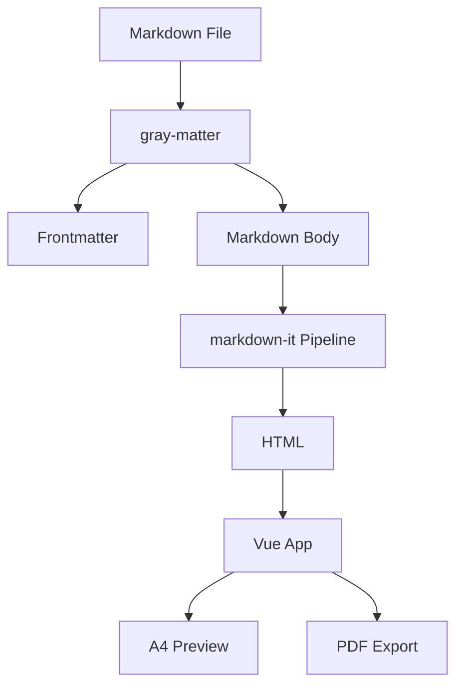

## Introduction

This is an example document for **@koumoul/doc**. It demonstrates the main features of the tool.

## Features

### Markdown Support

Standard markdown is fully supported:

- **Bold text** and *italic text*
- [Links](https://example.com)
- Inline `code` blocks

### Code Blocks

```javascript
function hello() {
  console.log('Hello from @koumoul/doc!')
}
```

```typescript
interface User {
  name: string
  email: string
}
```

### Tables

| Feature | Status |
|---------|--------|
| Markdown rendering | Done |
| A4 preview | Done |
| PDF export | Done |

### Custom Containers

:::info
This is an informational block with important details.
:::

:::tip
Here's a helpful tip for using the tool.
:::

:::warning
Be careful with this particular setting.
:::

:::danger
This action cannot be undone!
:::

### Diagrams



---

## Conclusion

This document serves as both a test fixture and an example of what @koumoul/doc can produce.
