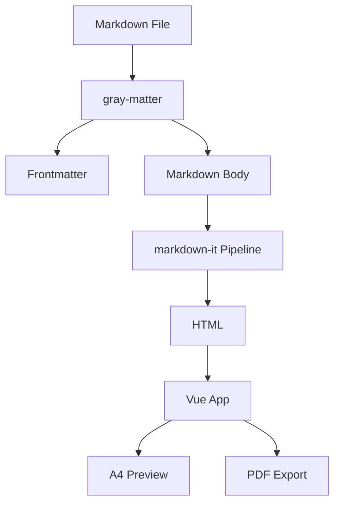
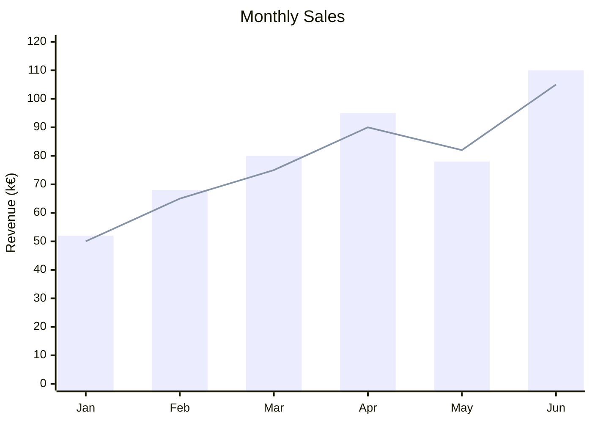

## Introduction

This is an example document for **@koumoul/doc**. It demonstrates the main features of the tool.

Jump to [Features](#features), [Custom Containers](#custom-containers) or the [Conclusion](#conclusion). Internal links use the heading's slug as anchor (e.g. `[Conclusion](#conclusion)`).

## Features

### Markdown Support

Standard markdown is fully supported:

- **Bold text** and *italic text*
- [Links](https://example.com)
- Inline `code` blocks

### Code Blocks

```javascript
function hello() {
  console.log('Hello from @koumoul/doc!')
}
```

```typescript
interface User {
  name: string
  email: string
}
```

### Tables

| Feature | Status |
|---------|--------|
| Markdown rendering | Done |
| A4 preview | Done |
| PDF export | Done |

### Custom Containers

:::info
This is an informational block with important details.
:::

:::tip
Here's a helpful tip for using the tool.
:::

:::warning
Be careful with this particular setting.
:::

:::danger
This action cannot be undone!
:::

### Images


### Diagrams





## Included sub-documents

This section demonstrates the `@<path>` include directive. The subsection below (and its nested deep-dive) are spliced in from files under `./chapters/`. Each file's images are resolved relative to that file's own directory, so sub-docs remain self-contained and can be edited in isolation.

@./chapters/overview.md

---

## Conclusion

This document serves as both a test fixture and an example of what @koumoul/doc can produce. There is a page break just before it.
